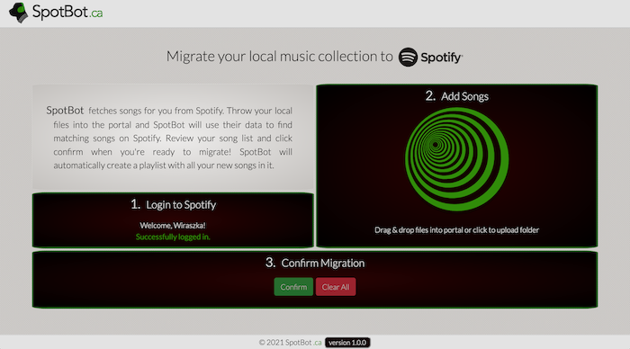
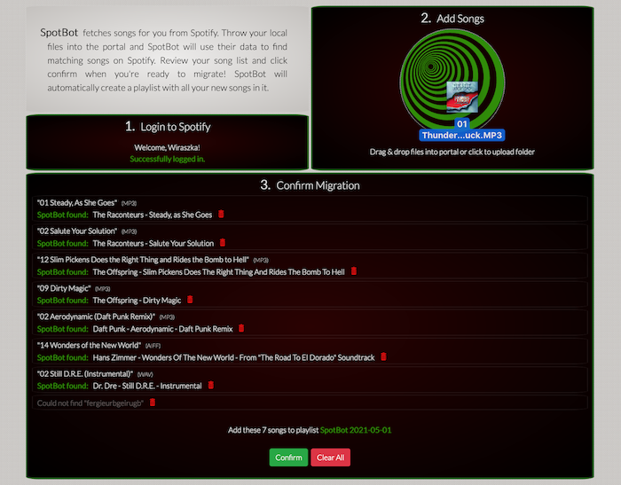
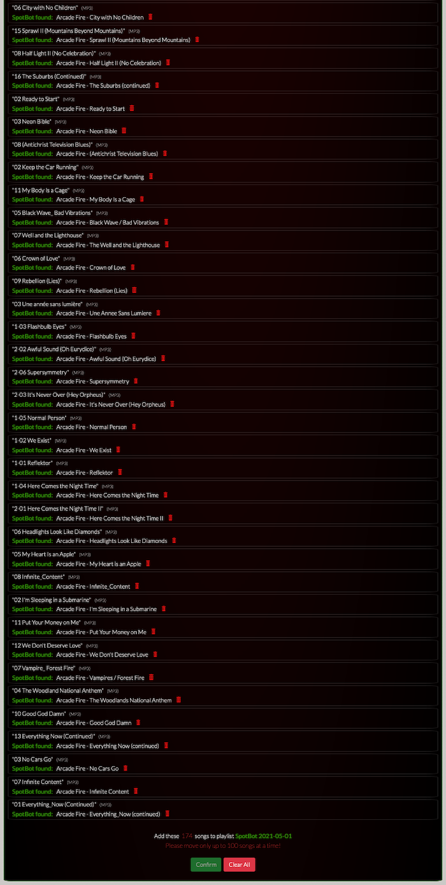
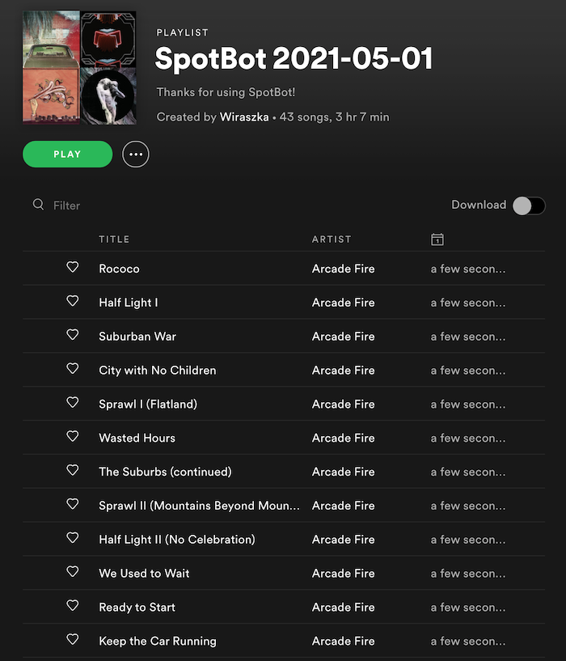

# SpotBot

<i>Migrate your local music collection to Spotify</i><br>
Live website available at:&nbsp; [spotbot.ca](https://spotbot.ca/)
***
<br>

SpotBot is a web application built using [Angular CLI](https://github.com/angular/angular-cli) that automates moving your local music collection to Spotify. The process consists of just three steps:

1. <span style="border: 1px solid grey; border-radius: 4px; padding: 0 2px;">
    Login to Spotify</span> through Spotify's secure account authentication system.
2. <span style="border: 1px solid grey; border-radius: 4px; padding: 0 2px;">
    Add Songs</span> by uploading or dragging & dropping your music into SpotBot's music portal.
3. <span style="border: 1px solid grey; border-radius: 4px; padding: 0 2px;">
    Confirm Migration</span> to move songs to Spotify.

And that's it – let us take care of the rest! SpotBot will create a playlist in your account and automatically populate it with all the songs it was able to find on Spotify.
<br><br>

## Development details

### System requirements

Libraries verified to be working for:

```
❯ node -v
v12.18.0

❯ npm --version
6.14.4
```

### Development server

* Run `ng serve` for a dev server. Navigate to `http://localhost:4200/`. The app will automatically reload if you change any of the source files.

* Run `ng generate component component-name` to generate a new component. You can also use `ng generate directive|pipe|service|class|guard|interface|enum|module`.

* Run `ng build` to build the project. The build artifacts will be stored in the `dist/` directory. Use the `--prod` flag for a production build.

* Run `ng test` to execute the unit tests via [Karma](https://karma-runner.github.io).

* Run `ng e2e` to execute the end-to-end tests via [Protractor](http://www.protractortest.org/).
<br><br>

## Spotify integration

https://developer.spotify.com/documentation/web-api/quick-start/

[SpotBot's Spotify Authentication Flow](https://docs.google.com/presentation/d/1qqGzH50ScbGdxuPcqgEPWwTDu0lu40HsVcIGo_vSNFk/edit)


### Firebase functions
Our backend server is powered via Firebase cloud functions.
```
firebase deploy --only hosting
firebase deploy --only functions
```


### Using functions

For Spotify login server side cloud functions:
1. Download secrets: firebase functions:config:get > .runtimeconfig.json
2. Test locally with emulator: firebase emulators:start

The emulator is setup to load files from the `dist` folder so you will have to do a `ng build` to serve any latest local changes. This should only be used for testing app + functions behaviour locally. For all other development it is recommended to use `ng serve` development flow.

### Deploy functions

Deployment has been auto-configured as part of the .github trigger. However, functions must still be deployed manually.

Ensure that before any pull request creation `npm run build` is run which will update the package.json version.
<br><br>

## Versioning

This project uses [SemVer](http://semver.org) for versioning.
* **Version 1.0.0** (released May 1, 2021):
    * Migrate up to 100 songs at a time with SpotBot's basic file name search algorithm
* **Version 1.0.1** (released May 2, 2021):
    * Minor text and logo layout change
<br><br>

## Authors

* [Juan Moreno](https://github.com/juansolu)
* [Michal Wiraszka](https://github.com/mwiraszka)
<br><br>

## License

This project is licensed under the MIT License - see the [LICENSE](LICENSE) file for details.
<br><br>

## Application Screenshots






